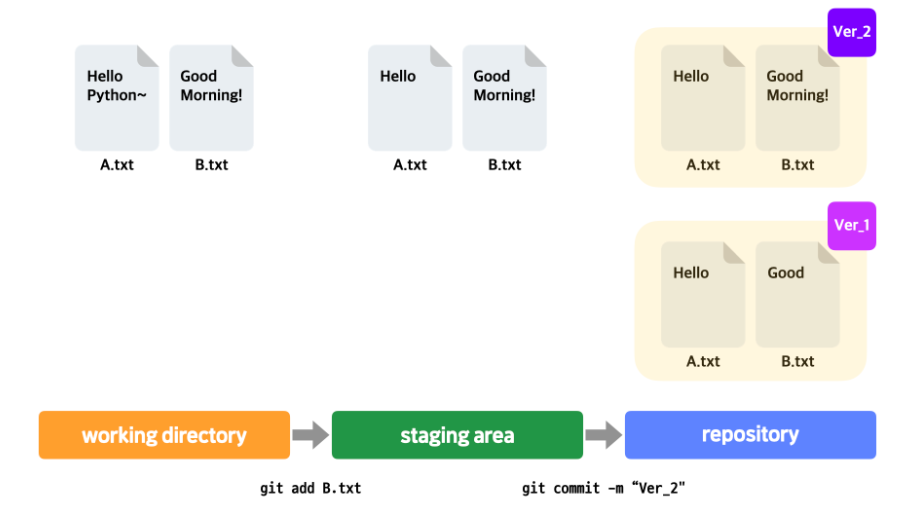

# 1주차 Git

# 1. Git 시작하기

## Git

리누스 토발즈가 만든 **버전 관리 및 협업용 프로그램**

- **버전관리** : 파일의 변화를 시간에 따라 기록했다가, 특정 시점에 버전을 다시 꺼내올 수 있는 시스템.
    - 지난 과정 확인 가능.
    - 이전 버전으로 돌아갈 수 있음.
- **동시협업** : 여러 개발자가 동시에 작성한 코드를 합칠 수 있게 도와줌
- **다른 컴퓨터에 작업물 보내기** : 외부 컴퓨터에 백업본을 만들어 둠.
    - 내 컴퓨터에 문제가 생겼을 때 외부 컴퓨터에서 백업본 가져올 수 있음.
    - 외부 컴퓨터에 있는 작업물을 팀원들이 각자 컴퓨터로 받아가서 작업한 후 다시 작업내용을 외부 컴퓨터에 올리는 방식으로 협업 가능.
    
    ⇒ 다른 컴퓨터 역할을 **Github**가 함.
    

## Github

**Git으로 관리하는 프로젝트의 복사본을 저장하는 서버를 제공**해주고 **협업을 위한 편의기능을 제공**해주는 서비스

# 2. Git 써보기

## Repository

프로젝트를 위해 만든 **디렉토리의 버전별 모습이 담기는 곳**.

프로젝트의 변경 사항들이 저장되어 있는 `**.git` 디렉토리**.

**커밋이 저장되는 곳**.

## Commit

프로젝트 **디렉토리의 모습을 하나의 버전으로** 남기는 행위 & 결과물.

## Repository 만들기

1. `mkdir 파일이름`
2. `git init`

## Commit 하기

1. 사용자의 이름, 이메일 주소 설정
    
    `git config [user.name](http://user.name) “이름”`
    
    `git config [user.email](http://user.email) “이메일”`
    
2. 커밋할 파일을 지정하기
    
    `git add 파일이름`
    
3. 커밋 메시지 남기기
    
    `git commit -m “메시지”`
    

## Git의 3가지 작업 영역

1. **working directory** : 작업을 하는 프로젝트 디렉토리.
2. **staging area** : `git add`를 한 파일들이 존재하는 영역. staging area에 있는 파일들이 커밋에 반영됨.
3. **repository** : working directory의 변경 이력들이 저장되어 있는 영역.



- **working directory**에서 A.txt, B.txt 수정
- `git add B.txt`로 B.txt를 **staging area**에 올림
- `git commit-m “Ver_2”`로 커밋 → **repository**에서 B.txt만 수정 내용이 반영됨

**원하는 파일만 다음 커밋에 반영**하고 싶은 경우가 있기 때문에 (세밀한 버전 관리) **staging area**가 필요함! 

## git add

- `git status` : 프로젝트 디렉토리의 현재 상태를 보여줌. 문제 상황 발생 시 현재 상태를 파악하기 위해 활용하면 좋음.
- `git add .` : 현재 프로젝트 디렉토리에서 변경 사항이 있는 모든 파일을 staging area로.
- `git reset 파일이름` : staging area에서 파일 제거. (변경된 모습은 working directory에 그대로 남아있음)

## 파일의 4가지 상태


- **Untracked**
    
    파일의 변동사항이 Git에 의해 추적되고 있지 않음. 파일을 새로 생성하고 한번도 git add 해주지 않았을 때.
    
- **Tracked**
    - **Staged**
        
        파일의 내용이 수정되고 나서 staging area에 올라와 있는 상태.
        
    - **Unmodified**
        
        현재 파일의 내용이 최신 커밋의 모습과 비교했을 때 바뀐 게 없는 상태.
        
    - **Modified**
        
        최신 커밋의 모습과 비교했을 때 바뀐 내용이 있는 상태.
        

## git 커맨드 사용법

- `git help` `man git-` : git으로 시작하는 커맨드들의 의미, 사용법을 좀 더 자세히 알고 싶을 때.

# 3. GitHub 시작하기

## Local Repository ↔ Remote Repository

- Remote Repository : GitHub에서 만든 레포지토리.
- Local Repository : 내 컴퓨터에 있는 레포지토리.

- `git push -u origin master` : 로컬 레포지토리의 내용을 처음으로 리모트 레포지토리에 올릴 때.
- `git push` : 로컬 레포지토리의 변경 내용을 리모트 레포지토리에 반영할 때.
- `git pull` : 리모트 레포지토리의 변경 내용을 로컬 레포지토리에 반영.

**Remote Repository를 왜 쓰는가?**

1. **안전성** : 로컬 레포지토리에 손상이 생겼을때를 대비.
2. **협업가능** : 리모트 레포지토리를 가운데에 두고 다른 개발자와 push, pull 하며 협업 할 수 있음.

**다른 사람도 내 리모트 레포지토리에 git push 할 수 있게 하려면?**

→ 원칙적으로 자신의 리모트 레포지토리에는 자신만 git push 할 수 있음. 다른 사용자도 할 수 있게 하려면 해당 리모트 레포지토리의 collaborator로 지정해줘야함.

**깃허브에 올라와 있는 프로젝트 레포지토리를 내 컴퓨터로 가져오려면?**

→ `git clone 깃허브주소` 

## 오픈 소스 프로젝트

**오픈소스** : 프로그램의 소스 코드가 대중에 공개된 상태.

**오픈소스 라이센스**

- 오픈소스가 활용된 부분이 있는 코드라면 그 코드도 오픈소스로 공개해야 함.
- 기존의 오픈 소스 내용 중 수정해서 사용한 부분이 있다면 그것을 표시하고 써야 함.

**오픈소스 프로젝트 장점**

- 무료로 사용할 수 있음.
- 여러 개발자들이 참여하기 때문에 폐쇄적으로 코드를 관리할 때보다 코드의 신뢰도가 높음.
- 오픈소스 프로젝트에 참여 중인 다른 개발자들에게 질문할 수 있음.
- 어떤 프로그램을 개발할 때 특정 분야에서 사실상 표준처럼 사용되는 오픈 소스 프로그램을 많이 활용할수록 전체 개발 속도를 단축할 수 있음.

**오픈소스 프로젝트 단점**

- 참여자 수가 많지 않거나, 참여자의 실력이 좋지 않으면 소스코드의 신뢰성을 보장하기 어려움.
- 해당 오픈소스를 사용해서 문제가 생겼을 때 보상을 해주거나 책임을 질 주체가 없음.
    
    ⇒ 충분히 공신력 있는 오픈소스 프로젝트인지 따져보고 사용해야 함.
    

## README

**README 파일의 내용**

- 이 프로젝트가 어떤 프로젝트인지 설명
- 프로그램의 주요 사용법
- 프로그램을 실행시키려면 어떤 사전 작업이 필요한지

GitHub에서는 [README.md](http://README.md) 파일을 프로젝트의 메인 화면에 보여주기 때문에 가독성 있게 작성하는 것이 중요. → **markdown 문법**

# 4. 커밋 다루기

- `git log` : 이태까지 한 커밋 히스토리들 확인 가능.

git은 각각의 커밋을 구별하기 위해 **커밋 아이디**(=커밋 해시)를 붙여서 관리.

```jsx
commit 7a75aa1572543c14afa8a0ac93ce6fb19450768d (HEAD -> main)
Author: yujeong <parkyj0430@gmail.com>
Date:   Mon May 13 16:51:40 2024 +0900

    Create calculator.py and License
```

- `git log --pretty=oneline` : 커밋 하나의 정보가 한 줄로 표현됨 (깔끔하게).
- `git show 커밋 아이디` : 해당 커밋에서 어떤 변화가 있었는지 확인 가능.

- `git commit` : 커밋 메시지를 쓸 수 있는 창을 띄워줌. -m을 쓰지 않아도 커밋 메시지 작성 가능. → 복잡하고 긴 커밋 메시지를 쉽게 남길 수 있음.

- `git commit --amend`  : 가장 최근 커밋 메시지를 수정해서 새로운 커밋으로 만들 수 있음.

- `git diff 커밋아이디1 커밋아이디2` : 두 커밋 간의 차이를 보여줌.

**커밋 메시지 작성 가이드라인**

1. 커밋 메시지의 제목과 상세 설명 사이에는 한 줄을 비운다. title과 body.
2. 커밋 메시지의 제목 뒤에 온점을 붙이지 않는다.
3. 커밋 메시지의 제목의 첫번째 알파벳은 대문자로 작성한다.
4. 커밋 메시지의 제목은 명령조로 작성한다.
5. 커밋 상세 내용에는 왜 커밋을 했는지, 어떤 문제가 있었는지, 적용한 해결책이 어떤 효과를 가지는지를 적으면 좋다.
6. 최대한 친절하게 작성한다.

**커밋할 때 알아야할 가이드라인**

1. 하나의 커밋에는 하나의 수정사항, 하나의 이슈를 해결한 내용만 남긴다. 다양하게 수정을 하고나서 하나의 커밋으로 남기는 것은 좋지 않다. (최대한 작은 단위의 변화를 기준으로 커밋)
2. 현재 프로젝트 디렉토리의 상태가 그 내부의 전체 코드를 실행했을 때 에러가 발생하지 않는 상태인 경우에만 커밋.

나중에 다시 봤을 때 이해하는데 어려움이 없도록, 다른 동료 개발자와 협업하는 데 방해가 되지 않도록 작성하는게 중요!

## alias 설정

길이가 긴 커맨드 전체에 별명을 붙여서 그 별명을 사용할 수 있도록 해주는 기능. aliasing 한다.

```jsx
git config alias.history 'log --pretty=oneline'
```

`git history`만 써도 자동으로 `git log --pretty=online`을 실행.

## HEAD

보통 가장 최근에 한 커밋을 가리킴. 매번 더 새로운 커밋을 가리킴.

**HEAD가 가리키는 커밋에 따라 working directory 구성.**

## git reset

- `git reset --hard 커밋아이디`  : HEAD의 위치를 특정 커밋으로 (과거 커밋) 바꿈. 특정 시점으로 돌아가 다시 작업할 수 있게 해줌.

**staging area에 올린 후 커밋을 하고 나면 staging area에 있던 파일들은?**

→ **그 상태 그대로 남아있음** (초기화x). 새로운 파일이 추가되거나 원래 있던 파일이 새로운 버전으로 교체되거나 할 뿐.

**reset 옵션**

`git reset [옵션] A`

- `hard` : HEAD가 A 커밋을 가리킴. staging area, working directory 모두 A 커밋처럼 바뀜. A 커밋 이후 working directory에서 한 작업들 사라짐.
- `mixed` : HEAD가 A 커밋을 가리킴. staging area A 커밋처럼 바뀜. working directory 모습은 안바뀜. HEAD가 A를 가리키더라도 working directory는 최근 작업한 모습 그대로.
- `soft` : HEAD가 A커밋을 가리키지만 staging area, working directory는 안바뀜.

hard 옵션은 커밋 이후 워킹 디렉토리 내용이 전부 사라지고, 복구 할 수 없기 때문에 별로 권장되지 않음!

- `git reset --hard HEAD^` : HEAD^가 현재 HEAD 바로 이전 커밋을 나타냄.
- `git reset --hard HEAD~X` : HEAD~X 현재 HEAD X단게 전 커밋을 나타냄.

→ 귀찮게 커밋 아이디를 쓰지 않고도 reset을 할 수 있음!

## 커밋에 tag달기

보통 프로젝트에서 주요 버전의 시작점이 되는 커밋에 Version1, Version2처럼 태그를 달음.

- `git tag 태그이름 커밋아이디` : 커밋에 태그를 달기.
- `git tag` : 이 프로젝트 디렉토리의 모든 태그를 조회.
- `git show 태그이름` : 태그와 연결된 커밋을 보여줌.

# 5. 브랜치 사용하기

## branch

하나의 코드 관리 흐름. git은 루트 커밋을 시작으로 가지가 갈라지는 나무 모양을 하고 있음. ex) 유료버전, 무료버전 만들 때 사용.

- `git branch 브랜치이름` : 브랜치 생성
- `git checkout 브랜치이름` : 해당 브랜치로 이동

A 브랜치에서 작업한 내용은 B 브랜치에 영향을 끼치지 않음!

- `git branch` : 현재 레포지토리에 있는 모든 브랜치 생성. 현재 위치한 브랜치 옆에 * 표시가 뜸.
- `git branch -d 브랜치이름` : 브랜치 삭제.
- `git checkout -b 브랜치이름` : 브랜치를 만듦과 동시에 해당 브랜치로 이동.

## branch merge

다른 브랜치에서 한 커밋을 가져오고 싶을 때 사용.

- `git merge 브랜치이름` : 현재 있는 브랜치에 특정 브랜치를 합침.

**merge conflict**


똑같은 부분을 두 브랜치에서 다르게 수정했을 때 git은 어느 것을 반영해야 할지 선택할 수 없음. → 사용자에게 알려줌.

**conflict 해결 방법**

1. conflict가 발생한 파일 열기.
2. merge의 결과가 되었으면 하는 모습대로 파일 수정.

conflict가 해결된 상태를 **resolved 상태**라고 한다.

**conflict가 발생했을 때 merge 자체를 취소하는 법**

- `git merge --abort` : merge를 시도하기 이전 모습으로 돌아옴.
1. conflict가 발생한 파일들이 너무 많아서 conflict를 최소화 할 수 있는 방식으로 파일들을 수정하고 커밋한 다음에 머지를 하고 싶을 때
2. 그냥 좀 더 나중에 merge하고 싶을 때

→ 머지 자체를 취소하면 됨.

**여러 파일에서 conflict가 발생했을때?**

→ 파일 하나씩 conflict를 해결하고 `git add 파일이름` 으로 하나씩 staging area에 올리거나, 모든 파일의 conflict를 해결하고 `git add .` 로 한번에 staging area에 올린 뒤 커밋.

## remote repository의 branch

로컬 레포지토리의 내용을 깃허브의 리모트 레포지토리로 보낼 때

```jsx
git remote add origin https://github.com/kyuri-dev/Math_Box.git
```

→ 주소의 리모트 레포지토리를 origin이라는 이름으로 등록.

(git에서 리모트 레포지토리를 최초로 추가할 때 origin이라는 이름으로 가리키는 것이 관례화 되어있음.)

```jsx
git push -u origin master
```

→ 현재 로컬 레포지토리에 있는 master 브랜치의 내용을 origin이라는 리모트 레포지토리로 보냄. origin이라는 리모트 레포지토리에 master 브랜치가 없으면 master 브랜치를 새로 생성하고 푸시함.

`-u` = `--set-upstream`

→ 로컬 레포지토리에 있는 master 브랜치가 origin에 있는 master 브랜치를 tracking하는 걸로 설정.

**traking** : 로컬 레포지토리의 한 브랜치가 리모트 레포지토리의 한 브랜치와 연결되어 그것을 계속 바라보는 상태. **tracking connection.**

traking connection이 한 번 설정되고 나면 `git push` , `git pull` 만 써도 동작.

※ `-u` 옵션을 주지 않으면

```jsx
git push origin master:master
```

이런식으로 매번 적어줘야 함.


- master : local repository
- origin/master : remote repository

## branch와 head의 관계

**branch** : 어떤 커밋을 가리키는 존재.

**head** : branch를 가리킴.


merge가 일어날 때

**git reset이 일어날 때**


1. HEAD는 여전히 같은 브랜치를 가리킴.
2. HEAD가 가리키는 브랜치가 다른 특정 커밋을 가리킴.
3. 이때문에 결국 HEAD가 간접적으로 가리키던 커밋도 바뀜.

**git reset을 한다고 그 이후의 커밋이 사라지는 것이 아님!**

git reset을 해도 커밋은 계속 남아있음. 따라서 과거의 커밋 뿐만아니라 커밋 이후의 커밋으로도 리셋할 수 있음.

**git checkout이 하는 일**

`git chekout` 을 쓰면 HEAD가 직접적으로 커밋을 가리키게 할 수 있음.

⇒ **Detached HEAD**

`git checkout 9033`  실행 시


**HEAD가 특정 커밋을 직접 가리키게 하는 이유?**

→ 특정 커밋을 시작점으 새로운 브랜치를 만들고 싶을 때

detached HEAD 상태에서 `git branch premium` 실행 시 아래와 같이 됨.


`git checkout premium` 을 하면 정상적인 상태로 돌아옴. → 9033으로부터 분기 가능.


⇒ `git checkout` 으로 HEAD가 직접적으로 가리키는 것을 바꿀 수 있고, 뒤에 커밋 아이디 또는 브랜치 이름을 줘서 HEAD가 직접적으로 커밋을 가리키거나 브랜치를 가리키도록 할 수 있다!

즉 `git checkout master` 는

- master 브랜치로 이동하라
- HEAD가 master 브랜치를 가리키도록 해라
- HEAD가 master 브랜치가 가리키던 커밋을 간접적으로 가리키게 됨으로써
- working directory의 내부도 그 커밋에 맞게 변함으로써
- master 브랜치로 이동한것을 사용자가 실감.

**git reset vs git checkout**


- `git reset --soft` / `git reset --mixed` 로 지우고 싶은 커밋으로 이동하고, `git commit`을 사용하여 깔끔하게 하나의 커밋을 남길 수 있음.

## 3-way merge vs Fast-forward merge

**3-way merge**


- 1 : 공통 조상 커밋
- 2 : 한 브랜치가 가리키는 커밋
- 3 : 다른 브랜치가 가리키는 커밋

**3 가지를 고려**해서 merge하는 방식.

- base때의 내용과 비교했을 때 달라진 부분이 있는 것이 우선시됨.
- 두 브랜치에서 둘 다 변화가 일어났을 때는 conflict를 발생시켜 사용자가 직접 선택하게 함.

**Fast-forward merge**


위 상태에서 `git merge premium` 을 하면 premium 브랜치가 가리키는 커밋을 master 커밋도 똑같이 가리키게 됨.

**새로운 커밋이 생기는게 아니라 단지 브랜치가 이동**하게 되는 merge 방식.

# 6. git 협업하기

## git pull vs git fetch

- 내가 로컬 레포지토리를 수정하는 동안 리모트 레포지토리에 변화가 생겼다면?
    - git pull을 먼저 하고, merge conflict를 해결한 뒤 git push!
    - `git pull` : 리모트 레포지토리의 브랜치를 가져와서 현재 브랜치에 merge하는 커맨드.
    - 협업에서 git push 전에 git pull을 해야 하는 경우가 많다.
- `git fetch` : 리모트 레포지토리에 있는 브랜치의 내용을 일단 가져와서 **점검해야할 필요**가 있을 때 사용. 자동으로 **merge 하지 않음**.
    - git fetch 후 git diff를 통해 두 브랜치 간의 차이를 볼 수 있음.
        
        `git diff 브랜치 origin/브랜치`
        
    - 리모트 레포지토리의 브랜치에 문제가 있을 때
        1. 잘못 코드를 추가한 개발자에게 수정 후 다시 올려달라고 하기.
        2. 잘못된 부분을 알아서 해결하고 git push하기.

## git blame

- `git blame 파일이름`  : 특정 코드를 누가 작성했는지 찾아내기 위한 커맨드. 특정 파일의 내용 한줄 한줄이 어떤 커밋에 의해 생성되었는지.

## git revert

- `git revert 커밋아이디` : 해당 커밋에서 했던 작업을 거꾸로 되돌리고, 그걸 다시 커밋함.
    - vs `git reset`? : git reset을 하게 되면 리모트 레포지토리의 커밋이 로컬 레포지토리보다 더 앞서있게 되므로 git pull을 먼저 해야함. 하지만 git revert는 새로운 커밋을 만드는 것이므로 문제x
- `git revert 커밋아이디1 커밋아이디2` : 커밋아이디1 **다음** 커밋부터 커밋아이디2 커밋까지 revert.

# 7. git 자유자재로 활용하기

## git reflog

- **git reset을 하여 과거 커밋으로 돌아가면 그 이후의 커밋들은 어떻게 되는가?**

→ 삭제되지 않고 남아있음! 이후 커밋들로 다시 reset 가능.

최신 커밋 아이디를 모르는 상태에서 reset 해버렸다면?

→ `git reflog` : HEAD가 가리켜왔던 커밋들에 대한 정보를 출력해줌.

## graph

- `--graph` : 커밋 히스토리가 각 브랜치와의 관계가 잘 드러나도록 그래프 형식으로 출력.
    
    `git log --pretty=oneline --all --graph`     
    

## rebase

- `git rebase 브랜치이름` : 지정한 브랜치를 현재 브랜치의 새로운 베이스로 만듦. 마치 거쳐온 것처럼.
- `git rebase --continue`

**merge vs rebase**

1. rebase는 새로운 커밋을 만들지 않는다.
2. rebase로 만들어진 커밋 히스토리는 merge로 만들어진 커밋 히스토리보다 깔끔하다.
    
    ⇒ 결과물은 같다. 
    
    두 브랜치를 합쳤다는 정보가 커밋 히스토리에 꼭 남아야 한다면 merge.
    
    커밋 히스토리를 깔끔하게 유지하고 싶을때는 rebase.
    

## git stash

- `git stash` : working directory에서 작업하던 내용을 아직 커밋하지 않았는데 다른 브랜치로 이동해야 할 때. stack에 저장됨.
    
    최근 커밋 이후로 작업했던 내용은 모두 스택에 옮겨지고 working directory 내부는 다시 최근 커밋 상태로 초기화.
    
- `git stash list` : 작업한 내용이 stack에 잘 들어가 있는지 조회.
- `git stash apply` / `git stash apply 아이디`: stack에 있는 내용을 working directory로 다시 가져옴.

- `git stash` : 잘못된 브랜치에서 작업했을 때도 사용. 작업 내용을 stack에 저장하고, 올바른 브랜치로 이동 후 apply 하는 방식.
    - `git stash drop 아이디` : 이미 적용한 작업 내용은 stack에서 지울 때.
- `git stash pop 아이디` : 특정 작업 내용을 적용함과 동시에 stack에서 제거하는 커맨드.

→ 작업 내용을 나중에 또 쓸 필요가 있다면 `git stash apply` , 또 쓸 필요가 없다면 `git stash pop` !

## git cherry-pick

- `git cherry-pick` : 원하는 작업이 들어있는 커밋들만 가져와서 현재 브랜치에 추가.

## .gitignore

- `.gitignore` : working directory 내에 존재하는 파일 중에서 마치 존재하지 않는 것처럼 인식해야 할 파일들의 목록.
    - 버전 관리 할 정도의 가치가 없고, 오히려 버전 관리를 하면 용량만 차지하고, 각 버전을 살펴볼 때 가독성을 떨어뜨리기 때문에 무시.